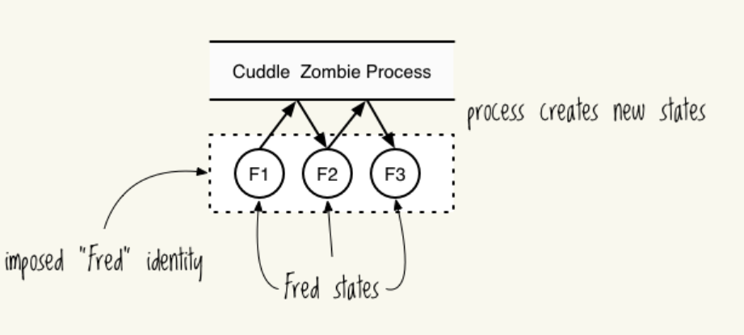

# `clojure`中的`state`

**三个概念：**

- `indentity`
- `state`
- `value`: atomic, 不可再分的。 如 `clojure`中的`number`，不可变。区分：`symbol`, `var`, `value`。

一个`indentity`可以拥有多个`state`，每个`state`都是一个`value`。`state`各不影响。 参考：



## `Atoms`

**改变状态的函数：**

- `reset!`: 直接赋予新的`value`
- `swap!`: 利用函数赋予新的`value`

例如：

```clj
(def a (atom false))
(reset! a (not @a))
(swap! a not)
;; 以上两种效果相同
```

检测变化，在使用`reset!`和`swap!`时起作用。`state`会成功更新：

- `add-watch`
- `remove-watch`

验证`validators`，在使用`reset!`和`swap!`时起作用。如果没有通过验证，`state`更新失败：

- 在`atom`中添加以`:validator`为`key`的`key-val`

## `Refs`

> `transaction`背后的原理是`STM`

可以同时改变多个`identity`的状态，这个过程可以称为`transaction`.

- atomic
- consistent
- isolated: 在同一个时间，只会有一个`transaction`改变一个`refs`.

一个`transaction`可以包含多个`atomic`操作。

**定义：**

- `def` & `ref`

`transaction`的使用：

- `dosync`: 初始化一个`transaction`
- `alter`: 操作`ref`
- `commute`: 操作`ref`

**注意：**

- `transaction`内的更改并不会立刻在其之外可见。您可以在一个`transaction`内连续两次使用`alter`，在`transaction`之外只会显示最终结果。
- `transaction`内使用`deref`则可以获取到新值。

```clj
(def counter (ref 0))
(future
  (dosync
   (alter counter inc)
   (println @counter)
   (Thread/sleep 500)
   (alter counter inc)
   (println @counter)))
(Thread/sleep 250)
(println @counter)
```

**很有趣：**
>The transaction will try to commit its changes only when it ends. 

1. Transaction A: alter gnome
2. Transaction B: alter gnome
3. Transaction B: alter dryer
4. Transaction B: alter dryer
5. Transaction B: commit—successfully updates gnome and dryer
6. Transaction A: alter dryer
7. Transaction A: alter dryer
8. Transaction A: commit—fails because dryer and gnome have changed; retries.

**`alter`和`commute`的提交动作不同。**

对于`alter`:

1. Reach outside the transaction and read the ref’s current state.
2. Compare the current state to the state the ref started with within the transaction.
3. If the two differ, make the transaction retry.
4. Otherwise, commit the altered ref state.

对于`commute`:

1. Reach outside the transaction and read the ref’s current state.
2. Run the commute function again using the current state.
3. Commit the result.

## `Vars`

**创建：**

```clj
(def ^:dynamic *notification-address* "dobby@elf.org")
```

- `^:dynamic`
- `*symbol*`

通过`binding`创建一个新的`scope`，改变其值：

```clj
(binding [*notification-address* "tester-1@elf.org"]
  (println *notification-address*)
  (binding [*notification-address* "tester-2@elf.org"]
    (println *notification-address*))
  (println *notification-address*))
; => tester-1@elf.org
; => tester-2@elf.org
; => tester-1@elf.org
```

**优势：**
>Dynamic vars are a great way to specify a common resource while retaining the flexibility to change it on an ad hoc basis.

**常见内建`Vars`:**

- `*out*`: print操作的标准输出。例如，可以更改输出到文件：
  ```clj
  (binding [*out* (clojure.java.io/writer "print-output")]
  (println "A man who carries a cat by the tail learns 
  something he can learn in no other way.
  -- Mark Twain"))
  (slurp "print-output")
  ```
- `*print-length*`: print操作对象为`coll`，该打印多少个`item`。
  ```clj
  (println ["Print" "all" "the" "things!"])
  ; => [Print all the things!]
  
  (binding [*print-length* 1]
  (println ["Print" "just" "one!"]))
  ; => [Print ...]
  ```

**常见用法：**

- 向函数传递参数，不必作为参数。
- 在函数内传递信息，不必作为返回值返回。例如：

```clj
(def ^:dynamic *troll-thought* nil)
(defn troll-riddle
  [your-answer]
  (let [number "man meat"]
➊     (when (thread-bound? #'*troll-thought*)
➋       (set! *troll-thought* number))
    (if (= number your-answer)
      "TROLL: You can cross the bridge!"
      "TROLL: Time to eat you, succulent human!")))

(binding [*troll-thought* nil]
  (println (troll-riddle 2))
  (println "SUCCULENT HUMAN: Oooooh! The answer was" *troll-thought*))

; => TROLL: Time to eat you, succulent human!
; => SUCCULENT HUMAN: Oooooh! The answer was man meat
```

`thread-bound?`检测`var`是否`binding`, `set!`设置其值。

**注意：**

- `binding`不会传递给手动创建的线程。
- `binding`可以传递给`feature`创建的线程。

例如：

在 repl 中`*out*` 自动绑定到标准输出，于是有：

```clj
(.write *out* "prints to repl")
; => prints to repl
```

手动创建线程：

```clj
(.start (Thread. #(.write *out* "prints to standard out")))
```

什么都不会打印。

通过`bound-fn`解决：

```clj
(.start (Thread. (bound-fn [] (.write *out* "prints to repl from thread"))))
```

**改变`Var` Root**

- `alter-var-root`: 用法同`swap!`，**永久**改变 root 中的 `var`。
  ```clj
  (def power-source "hair")
  (alter-var-root #'power-source (fn [_] "7-eleven parking lot"))
  power-source
  ; => "7-eleven parking lot"
  ```
- `with-redefs`： 用法同`binding`，**暂时**改变 `var`, 可以作用于任何`var`。
  ```clj
  (with-redefs [*out* *out*]
        (doto (Thread. #(println "with redefs allows me to show up in the REPL"))
          .start
          .join))
  ```

都不建议在生产环境中使用。

## `Stateless Concurrency`

对于无状态的并发，可以使用`pmap`简化实现。

**注意：**

- 创建线程需要花费时间，所以，每个线程尽量做的多的任务。

**一个简单的例子：**

```clj
(def alphabet-length 26)

;; Vector of chars, A-Z
(def letters (mapv (comp str char (partial + 65)) (range alphabet-length)))

(defn random-string
  "Returns a random string of specified length"
  [length]
  (apply str (take length (repeatedly #(rand-nth letters)))))
  
(defn random-string-list
  [list-length string-length]
  (doall (take list-length (repeatedly (partial random-string string-length)))))

(def orc-name-abbrevs (random-string-list 20000 300))
(time (dorun (map clojure.string/lower-case orc-name-abbrevs)))
; => "Elapsed time: 78.23 msecs"
(time (dorun (pmap clojure.string/lower-case orc-name-abbrevs)))
; => "Elapsed time: 124.727 msecs"

;; 优化
(defn ppmap
  "Partitioned pmap, for grouping map ops together to make parallel
  overhead worthwhile"
  [grain-size f & colls]
  (apply concat
   (apply pmap
          (fn [& pgroups] (doall (apply map f pgroups)))
          (map (partial partition-all grain-size) colls))))
(time (dorun (ppmap 1000 clojure.string/lower-case orc-name-abbrevs)))
; => "Elapsed time: 44.902 msecs"
```

继续优化，可以学习下面这个库：

[http://clojuredocs.org/clojure.core.reducers](http://clojuredocs.org/clojure.core.reducers)

## 补充 `agent`

>- 只能在`clojure`中使用.
>- 不修改其它为非当前类型的值
>- `agent`,代理,其含义是: 执行他人发送而来的`action`。每个`action`类型的`symbol`只有一个代理，每个每次只能执行一个`action`。所以，不同线程之间不需要`coordinate`。

**创建**

```clj
(def a (agent 100))
```

**修改**

- `send`
- `send-off`

两者的区别在于使用不同的线程池。具体参考：
> The `send` function uses a "fixed thread pool" (see the newFixedThreadPool method in java.util.concurrent.Executors) where the number of threads is the number of processors plus two.If all of those threads are busy, the action doesn't run until one becomes available.

>The `send-off` function uses a "cached thread pool" (see the newCachedThreadPool method in java.util.concurrent.Executors) where existing threads in the pool are used if available and new threads are added otherwise

修改值的过程是异步的。例如：

```clj
(def a (agent 100))
(future (send a + 10000) (println @a))
;;=> 100
;;=> #object[clojure.core$future_call$reify__8439 0x7383d78c {:status :pending, :val nil}]
```

**等待/阻塞**

- `wait`
- `wait-for`

接受一系列`action`，阻塞当前线程，直到所有`action`完成。


