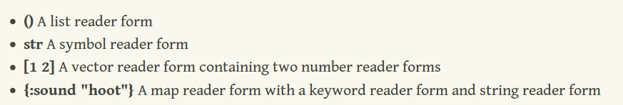

# REPL

其含义为`read-eval-print-loop`.

## `reader` 和 `evaluator`

input(reader forms) -> reader -> output(data structures) -> evaluator -> result.

常见函数：

- `read-string`, 可以模拟`reader`的函数
- `eval`, 可以模拟 `evaluator` 的函数

`reader`是将输入转换为可以被`evaluator`使用的 `data structures`。所以，一些`reader forms`可以直接
映射为`data structures`，如：



## Macro

- `macro`在`reader`和`evaluator`之间执行，操作`reader`输出的结果，最终传递给`evaluator`。

- 使用`defmacro`书写宏语句，返回的计算后的值; 使用`函数`书写宏语句，返回的是`data structure`。

- 传递给`函数`的参数语句会先被计算后传递给函数; 传递给`defmacro`的参数则是可在`eval`之前操作的。

### `～`

对于`～`， 可以对一段表达式求值，不能进行嵌套。例如：

```clj
;;; 正确
(defmacro m-add
  [expression]
  `(println (quote ~expression) "is: "
            ~(list (second expression) (first expression) (last expression))))

;;; 错误
(defmacro m-add
  [expression]
  `(println (quote ~expression) "is: "
            ~(list (second ～expression) (first ～expression) (last ～expression))))

```

