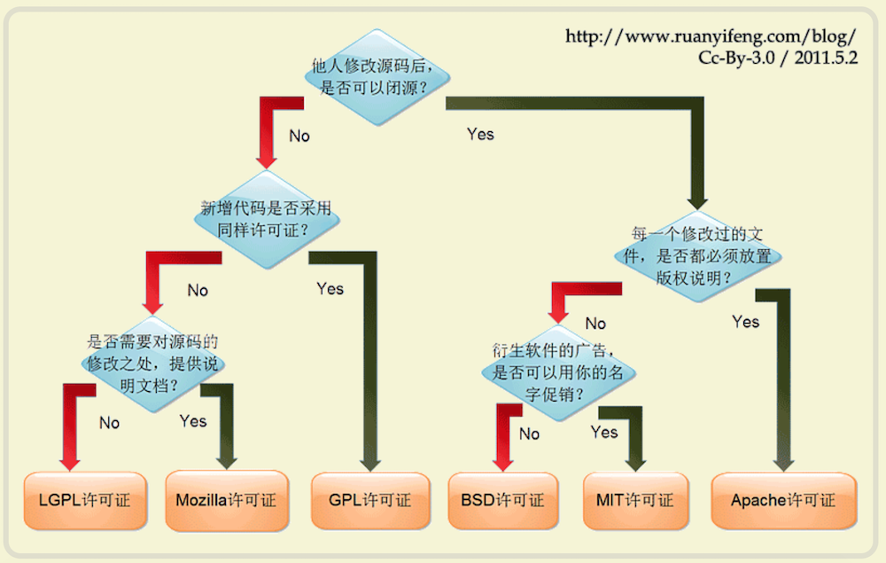

# 使用第三方库

## 如何使用？

常见四种方法：

- cocoaPads库管理软件
- 复制所有源文件
- 静态库链接
- .xcodeproj 文件

参考：[https://blog.csdn.net/iosswift/article/details/49049939](https://blog.csdn.net/iosswift/article/details/49049939)

## 理解动态库和静态库

下面这两篇文章结合起来阅读，互作补充：

- [https://www.jianshu.com/p/6300a3cbde1a](https://www.jianshu.com/p/6300a3cbde1a)
- [https://juejin.im/post/5a323c035188257dd239abc2](https://juejin.im/post/5a323c035188257dd239abc2)

## cocoPads

### 基本使用方法与创建支持`cocoaPads`项目的方法：

[https://juejin.im/entry/5c067eb56fb9a04a0a5ef583](https://juejin.im/entry/5c067eb56fb9a04a0a5ef583)

### `Podfile`使用详解：

[https://www.jianshu.com/p/b8b889610b7e](https://www.jianshu.com/p/b8b889610b7e)

但是，`inherite!`说的不是很清楚，参考下面文章的该部分:

[http://ibloodline.com/articles/2017/12/27/podfile-syntax-reference.html](http://ibloodline.com/articles/2017/12/27/podfile-syntax-reference.html)

附录：

- [语义化版本](https://semver.org/lang/zh-CN/)
- 常见开源协议的关系

## `.xcodeproj`方式引入

通过该方式，可以引入`.a`静态库，也可以直接引入源文件。

### 引入`.a`静态库

参考方法二：

[https://www.cnblogs.com/lwme/p/using-libraries-in-ios.html](https://www.cnblogs.com/lwme/p/using-libraries-in-ios.html)

更加清晰的一个教程：

[https://www.cnblogs.com/mupiaomiao/p/4699042.html](https://www.cnblogs.com/mupiaomiao/p/4699042.html)

### 直接引入源文件

直接在`Libraries`中添加`.xcodeproj`。但是，问题在于：

- 如何配置编译？会自动编译进去？
- `.a`静态方法效率更高，为什么要尝试呢？

需要补充。

## 静态库链接

- 通过`.xcodeproj`的方式引入
- 通过`.framework`的方式引入

## 复制所有源文件

复制到自己项目`.h`和`.m`文件存在的地方。需要手动补充第三方依赖。

*和`.xcodeproj`引入的其中一种方式类似。*

## 总结

除了`cocoaPads`， 其他几种方法相对来说，比较麻烦。但是，使用`cocoaPads`的条件比较严格：

- 必须包含`.podspec`文件，也就是加入其生态。

