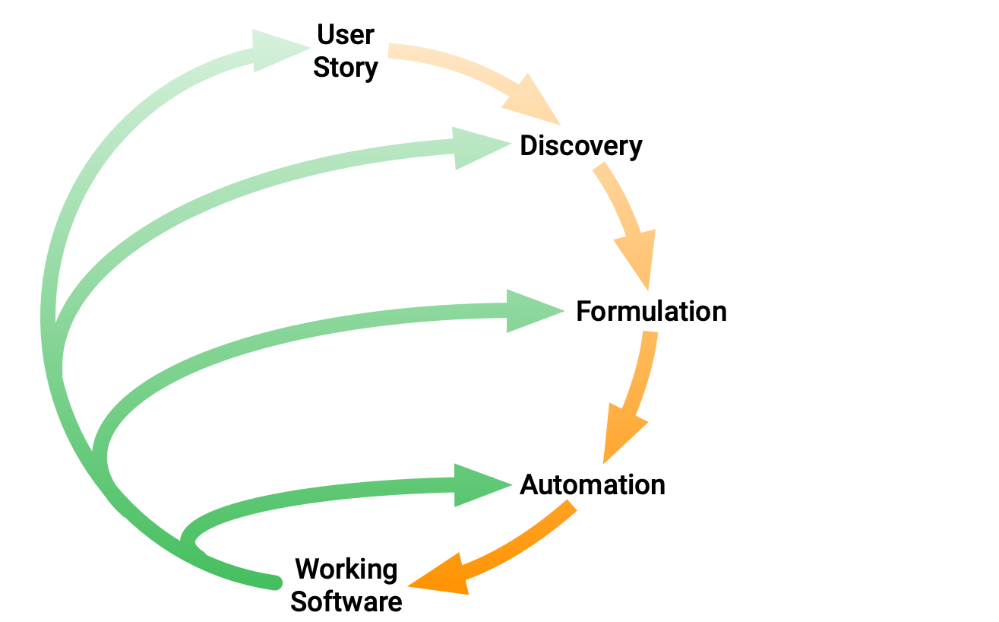

# What's BDD？

BDD将TDD的一般技术和原理与领域驱动设计(DDD)的想法相结合。 BDD是一个设计活动，您可以根据预期行为逐步构建功能块。

> A team using Behaviour Driven Development use conversations and collaboration around concrete examples to build up a shared understanding of the features they are supposed to build. Conversations about concrete examples, and counter-examples, are a great way to flush out any hidden assumptions or misunderstandings about what a feature needs to do.

Three pratices:

- Discovery: What it could do
  -  Focus around real-world examples of the system from the users’ perspective
- Formulation: What it should do
  - Formulate each example as structured documentation, aka executable specification. This can be read by both humans and computers.
- Automation: What it actually does
  - Implement the examples
  - Connect it to system as a test

## 优点

- BDD的核心价值是体现在正确的对系统行为进行设计。
- 它强调的是系统最终的实现与用户期望的行为是一致的、验证代码实现是否符合设计目标。
- BDD倡导的用简洁的自然语言描述系统行为的理念，可以明确的根据设计产生测试，并保障测试用例的质量。

##  缺点

- 它本身并不强调对系统功能、性能以及边界值等的健全性做保证，无法像完整的测试一样发现系统的各种问题
