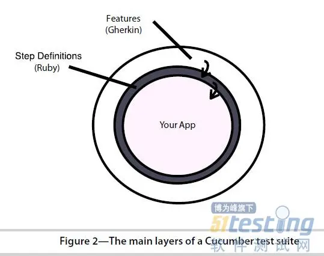
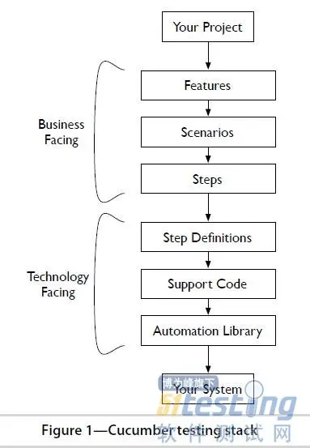

# 框架组成和基本概念

## 基本概念

## 框架组成

### 三大组成：

**featured**

- 基于`Gherkin`。支持语言： `en, zh-CN`等。
- `Feature`文件必须以`.features`命名。
- 每个`Feature`文件包含：一个`title`,多个`scenario`，每个`scenario`包含多个`step`。
- `Step`相关关键字：`Given`(前置条件)，`When`(测试内容/事件)，`Then`(验证结果)，`And`和`But`。 (通常缩写为`GWT`)

**Step definitions**

- 根据`feature`文件中定义的`step`编写对应的测试代码。

**Cucumber command**

- 运行测试
- 结果以`html`形式保存；`fail`可以查看`log`寻找分析原因。

### 和传统功能对应关系：

- Feature (功能)-------------test suite （测试用例集）
- Scenario（情景)-----------test case （测试用例）
- Given（给定）-------------setup（创建测试所需环境）
- When（当）----------------test（触发被测事件）
- Then（则）-----------------assert(断言，验证结果)

## 工作原理

## 开发过程

- 创建`feature`文件，包括`feature,scenarios`和`step`。
- 创建`step_definitions`，即RUBY代码并实现。如果只有step，没有step definitions，会报undefined错。Ruby写法：`Given /^the input "([^"]*)"$/ do |arg1|`。运行`feature`，控制台中会输出RUBY的实现方法，只要实现`step_definitions`即可。
- `cucumber --format progress`。格式化输出。可修改为`html，xml`等格式输出。
- 添加断言：
  - 一个场景失败，`Cucumber`将此场景标记失败，转去执行下一场景。
  - 一个`step`失败，会跳过这个`scenario`的其余`step`，从而终止这个`scenario`。

## 其他

实际上是一个系统文档框架
